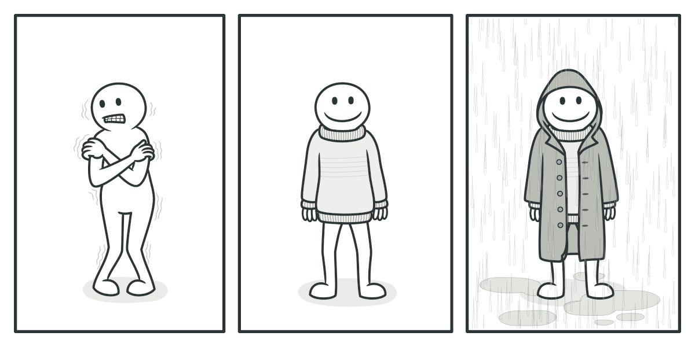
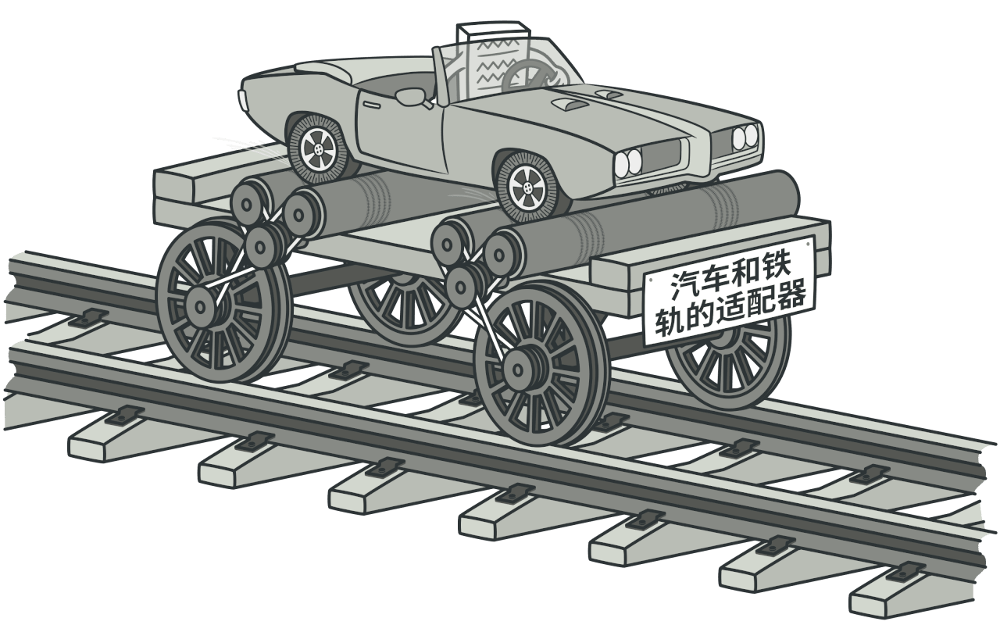
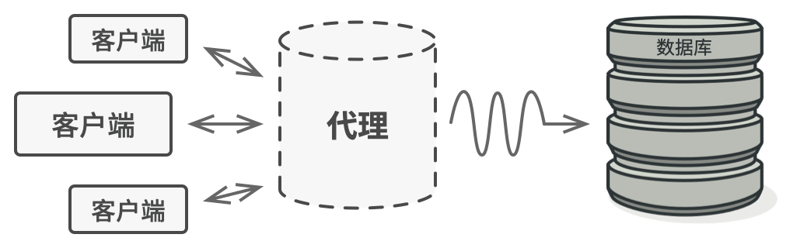

# go设计模式


### 结构型模式
#### 1. 结构型模式解决什么问题
结构模式关注类和对象的组合，解决如何将类和对象组装成较大结构的同时，保持结构的灵活和可复用性。

#### 2.装饰模式(俄罗斯套娃)
装饰模式是对基类进行包装(装饰)从而为对象增加新功能或改变原有功能，操作对象和装饰器对象由于实现了同一接口，
因而操作对象可以用装饰器进行多次(套娃式)封装，对象将获得所有装饰器作用叠加后的功能。




下面代码描述了如何通过层层装饰返回一个满足顾客要求的披萨，并计算价格
```go
package main

import "fmt"

type IPizza interface {
	getPrice() int
}

// 基类: 素食披萨
type Vegetable struct {
}

func (v Vegetable) getPrice() int {
	return 10
}

// 装饰器1: 奶酪装饰器
type Cheese struct {
	pizza IPizza
}

func (c Cheese) getPrice() int {
	return c.pizza.getPrice() + 3
}

// 装饰器2:
type Tomato struct {
	pizza IPizza
}

func (c Tomato) getPrice() int {
	return c.pizza.getPrice() + 4
}

func main() {

	vegetablePizza := Vegetable{}

	cheeseVegePizza := Cheese{vegetablePizza}

	tomatoCheeseVegePizza := Tomato{cheeseVegePizza}

	fmt.Printf("加了番茄和奶酪的披萨最终价格:%d\n", tomatoCheeseVegePizza.getPrice())

}


// output
// 加了番茄和奶酪的披萨最终价格:17
```


#### 3.适配器模式
适配器模式可以通过一个中间层使不兼容的两个对象互相合作，适配器接收对象对其调用，并将此调用装换为对另一个对象的调用。适配就好比现实世界中的扩展坞将A和B
两个接口之间做了一层装换



下面代码描述了如何通过适配器让只支持usb的windows电脑，也能使用雷电接口
```go
package main

import "fmt"

type Computer interface {
	InsertIntoLightningPort()
}

type Client struct {
}

// 给电脑插入雷电接口
func (t Client) InsertLightIntoComputer(c Computer) {
	c.InsertIntoLightningPort()
}

type Mac struct {
}

// mac电脑使用雷电接口
func (m Mac) InsertIntoLightningPort() {
	fmt.Println("给mac电脑插入雷电接口")
}

type Windows struct {
}

// windows电脑使用usb接口
func (m Windows) InsertIntoUsbPort() {
	fmt.Println("给windows电脑插入usb接口")
}

type WindowsAdapter struct {
	windows Windows
}

// 适配器 将雷电接口转为usb接口
func (w WindowsAdapter) InsertIntoLightningPort() {
	fmt.Println("转换雷电接口为usb接口")
	w.windows.InsertIntoUsbPort()
}

func main() {
	mac := Mac{}
	client := Client{}

	client.InsertLightIntoComputer(mac)

	windows := Windows{}

	adapter := WindowsAdapter{windows: windows}

	client.InsertLightIntoComputer(adapter)
}


// output
// 给mac电脑插入雷电接口
// 转换雷电接口为usb接口
// 给windows电脑插入usb接口

```
#### 4.代理模式
代理模式可以替代原对象，处理对原对象的调用，通常会在对原对象的调用`前后`做一些同一的处理，例如nginx代理web应用处理请求，在流量真正到达
web应用程序前做请求的负载均衡，之后决定将请求转发给哪台服务器。



下面代码实现了nginx代理web应用程序做接口限流：

```go
package main

import "fmt"

// web服务应该具有处理请求的能力
type Server interface {
	handleRequest(url, method string) (int, string)
}

// web应用程序
type Application struct {
}

func (a Application) handleRequest(url, method string) (int, string) {
	if url == "/app/status" && method == "GET" {
		return 200, "Ok"
	}

	if url == "/create/user" && method == "POST" {
		return 200, "User Created Success!"
	}
	return 404, "404 Not Found"
}

// nginx 代理web应用处理请求，做api接口请求限流
type NginxServer struct {
	application  Application
	MaxReqNum    int            // 最大请求数
	LimitRateMap map[string]int // 缓存每个接口的请求数
}

func NewNginxServer(app Application, max int) *NginxServer {
	return &NginxServer{
		application:  app,
		MaxReqNum:    max,
		LimitRateMap: make(map[string]int),
	}
}

// 代理web应用请求
func (n NginxServer) handleRequest(url, method string) (int, string) {
	if !n.checkReqRate(url) {
		return 403, "Not Allowed"
	}

	// 接口限流后转发请求到真实web应用
	return n.application.handleRequest(url, method)
}

// 接口限流和缓存
func (n *NginxServer) checkReqRate(url string) bool {
	reqNum := n.LimitRateMap[url]

	if reqNum >= n.MaxReqNum {
		return false
	}
	n.LimitRateMap[url]++

	return true
}

func main() {

	nginx := NewNginxServer(Application{}, 2)
	respCode, respBody := nginx.handleRequest("/app/status", "GET")
	fmt.Printf("URL:%s \n返回状态码:%d,响应内容:%s \n\n", "/app/status", respCode, respBody)

	respCode, respBody = nginx.handleRequest("/app/status", "GET")
	fmt.Printf("URL:%s \n返回状态码:%d,响应内容:%s \n\n", "/app/status", respCode, respBody)

	// 超过了最大限流数 返回403
	respCode, respBody = nginx.handleRequest("/app/status", "GET")
	fmt.Printf("URL:%s \n返回状态码:%d,响应内容:%s \n\n", "/app/status", respCode, respBody)

	respCode, respBody = nginx.handleRequest("/create/user", "POST")
	fmt.Printf("URL:%s \n返回状态码:%d,响应内容:%s \n\n", "/create/user", respCode, respBody)

}

/* output
URL:/app/status
返回状态码:200,响应内容:Ok

URL:/app/status
返回状态码:200,响应内容:Ok

URL:/app/status
返回状态码:403,响应内容:Not Allowed

URL:/create/user
返回状态码:200,响应内容:User Created Success!

*/

```


#### 5.总结
下面是分别是这3种设计模式的应用场景:

| 设计模式  | 常见应用场景                         |
|-------|--------------------------------|
| 装饰器模式  | 不修改原有对象结构，运行时为对象新增额外功能    |
| 适配器模式  | 想使用某个类，但这个类和要使用的其他代码不兼容时，创建一个中间层类   |
| 代理模式 | 延迟初始化真实对象，先使用虚拟代理，请求代理(记录日志，请求缓存，请求限流，代理远程服务) |


### 行为型模式
#### 1. 行为模式解决什么问题
结构模式关注对象之间的通信和职责委派。下面介绍go中比较常用的3种设计模式分别是策略模式，模版模式，观察者模式。


#### 2.策略模式
策略模式将一组行为分别封装成不同对象，使得这些对象可以根据需要任意替换，而不影响原有代码的逻辑流程。其本质是通过接口，解耦行为和调用该行为的对象。
最常见的应用场景就是缓存库的设计，需要根据实际需要自行选择和灵活替换缓存淘汰算法（常见的有LRU,FIFO,LFU），甚至自定义缓存淘汰算法，而我们只需要实现缓存淘汰算法所规定的方法
就可以替换不用的策略，需要注意的是为了方便替换，我们往往会设置下属代码中诸如`setEvictStrategy()`的方法进行策略替换。

```go
package main

import "fmt"

// 策略接口
type EvictionAlgorithm interface {
	evict()
}

type Lru struct {
}

// lru 的实现
func (c Lru) evict() {
	fmt.Println("evicting by lru strategy")
}

type Fifo struct {
}

// fifo 的实现
func (c Fifo) evict() {
	fmt.Println("evicting by fifo strategy")
}

type Cache struct {
	storage           map[string]string
	evictionAlgorithm EvictionAlgorithm
	capacity          int
	maxCapacity       int
}

func NewCache(e EvictionAlgorithm) *Cache {
	return &Cache{
		storage:           make(map[string]string, 0),
		evictionAlgorithm: e,
		capacity:          0,
		maxCapacity:       0,
	}
}

// 设置策略
func (c *Cache) setEvictStrategy(e EvictionAlgorithm) {
	c.evictionAlgorithm = e
}

func (c *Cache) evict(){
	c.evictionAlgorithm.evict()
	c.capacity--
}

func (c *Cache) Add(k, v string) {
	if c.capacity >= c.maxCapacity {
		c.evict()
	}

	c.storage[k] = v
	c.capacity++
}

func main() {
	CacheClient := NewCache(nil)

	lurStrategy := Lru{}
	CacheClient.setEvictStrategy(lurStrategy)

	CacheClient.Add("a","1")
	CacheClient.Add("b","2")


	fifoStrategy := Fifo{}
	CacheClient.setEvictStrategy(fifoStrategy)

	CacheClient.Add("a","1")
	CacheClient.Add("b","2")


}

```
#### 3.模版模式
模版模式在基类中定义了一系列的逻辑（算法，业务逻辑）的框架，可以通过子类重写逻辑的特定步骤，而不修改原有结构。其本质是将公共的方法放到抽象类中，而通同接口将
不能通用的方法定义为接口，让实现了接口的子类去实现这部分差异的方法。下面代码演示了一种场景，给用户发送验证码，可以有短信和邮件两种方式，而在这之前的
业务逻辑是共用的，例如第一步生成验证码，第二步保存验证码...,因此像这种操作步骤的流程是相同的只是某几个实现方式不同的场景就可以使用模版模式。
```go
package main

import "fmt"

type IVerificationCode interface {
	genCode() string
	saveCode(code string) error
	getMsg(code string) string
	sendMsg(msg string) error
}

func genAndSendCode(opt IVerificationCode) error {
	code := opt.genCode()

	if err := opt.saveCode(code); err != nil {
		return err
	}
	msg := opt.getMsg(code)

	if err := opt.sendMsg(msg); err != nil {
		return err
	}

	return nil
}

// 公共部分抽象
type CodePart struct {
}

func (c CodePart) genCode() string {
	return "1234"
}

func (c CodePart) getMsg(code string) string {
	return fmt.Sprintf("你的验证码是：%s", code)

}

func (c CodePart) saveCode(code string) error {
	fmt.Printf("服务端保存了验证码：%s\n", code)
	return nil
}

type SmsCode struct {
	CodePart
}

func (s SmsCode) sendMsg(code string) error {
	fmt.Println("通过短信的方式发送了验证码")
	return nil
}

type EmailCode struct {
	CodePart
}

func (e EmailCode) sendMsg(code string) error {
	fmt.Println("通过邮件的方式发送了验证码")
	return nil
}

func main() {

	sms := SmsCode{}

	if err := genAndSendCode(sms); err != nil {
		return
	}

	email := EmailCode{}

	if err := genAndSendCode(email); err != nil {
		return
	}

}

```

#### 4.观察者模式
观察者模式提供了一种把一个对象其状态的变更，通知给实现了订阅者接口的对象(观察者)的机制，同时其他对象(观察者)可以此对象(被观察的对象)进行订阅和取消订阅。其本质是通过接口解耦通知对象和
被通知对象这种一对多的关系，使得通知对象和接口，接口和被通知对象简化为简单的一对一关系。
下面的代码实现了当某个商品有库存的时候，通知订阅了这个商品上架提醒的顾客
```go
package main

import "fmt"

type Subject interface {
	register(observer Observer)
	deregister(observer Observer)
	notifyAll()
}

type Item struct {
	observerList []Observer
	name         string
	inStock      bool
}

func NewItem(name string) Item {
	return Item{name: name}
}

func (i *Item) register(observer Observer) {
	i.observerList = append(i.observerList, observer)
}

func (i *Item) deregister(observer Observer) {
	// todo remove observer from observerList
}

func (i *Item) notifyAll() {
	for _, v := range i.observerList {
		v.update(i.name)
	}
}

func (i Item) updateAvailability() {
	fmt.Printf("item %s is now in stock\n", i.name)
	i.inStock = true
	i.notifyAll()
}

type Observer interface {
	update(string)
}

type Customs struct {
	id string
}

func (c Customs) update(name string) {
	fmt.Printf("send email to customer %s for item %s\n", c.id, name)
}

func main() {
	book := NewItem("《设计模式：可复用面向对象软件的基础》")

	book.register(&Customs{id: "a@qq.com"})
	book.register(&Customs{id: "b@qq.com"})

	book.updateAvailability()

}

```

#### 5.总结
下面是分别是这3种设计模式的应用场景:

| 设计模式  | 常见应用场景                         |
|-------|--------------------------------|
| 策略模式  | 按照实际需求要对系统的算法做任意替换，而不影响原有代码    |
| 模版模式  | 固定的流程和逻辑，但不同对象在某些步骤上的实现方式有差别   |
| 观察者模式 | 一个对象(被观察者)需要将其状态的变化通知其他对象(观察者) |


